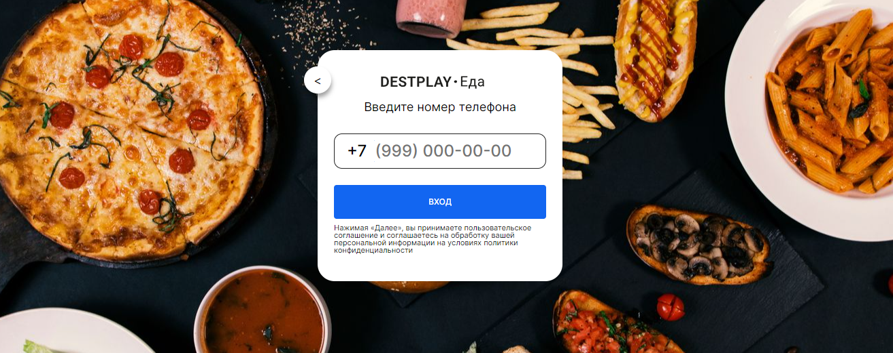

<p align="center">

</p>
 
## Auth Sms
Кароч изи пакет авторизации по смс
   

## Установка
1) Установить из композера 
```  
composer require slavawins/authsms
```

2) Опубликовать js файлы, вью и миграции необходимые для работы пакета.
Вызывать команду:
   ```
   php artisan vendor:publish --provider="SlavaWins\AuthSms\Providers\AuthSmsServiceProvider"
   ``` 


3) В env нужно указать настройки для плагина
 ```
#---- AuthSms Settings
#Если true то код смс всегда будет 1111
AUTHSMS_TEST_MODE=true

#Ключ от апи sms.ru
AUTHSMS_SMSRU_API_KEY=xxx
 ``` 


4) В роутере routes/web.php удалить:
 ```
    Auth::routes();
 ``` 
И добавить
 ```
    AuthSmsRoute::routes();
 ``` 


5) Выполнить миграцию
 ```
    php artisan migrate 
 ``` 


6) В папке resources\views\authsms\layout.blade.php  нужно указать ваш layout который вы используете.
И заменить app-col на "content". Вообщем нужно сделать так как оно должно работать у вас.
 ```
  @extends('layouts.app')
  
  @section('app-col')
 ``` 

 
7) Пользователь создается в экшен классе app\Actions\AuthSms\CreateNewUser.php
Там вы можете указать кастомные поля, и напримере если у вас что-то не может быть nullable и не имеет defualt value. 
